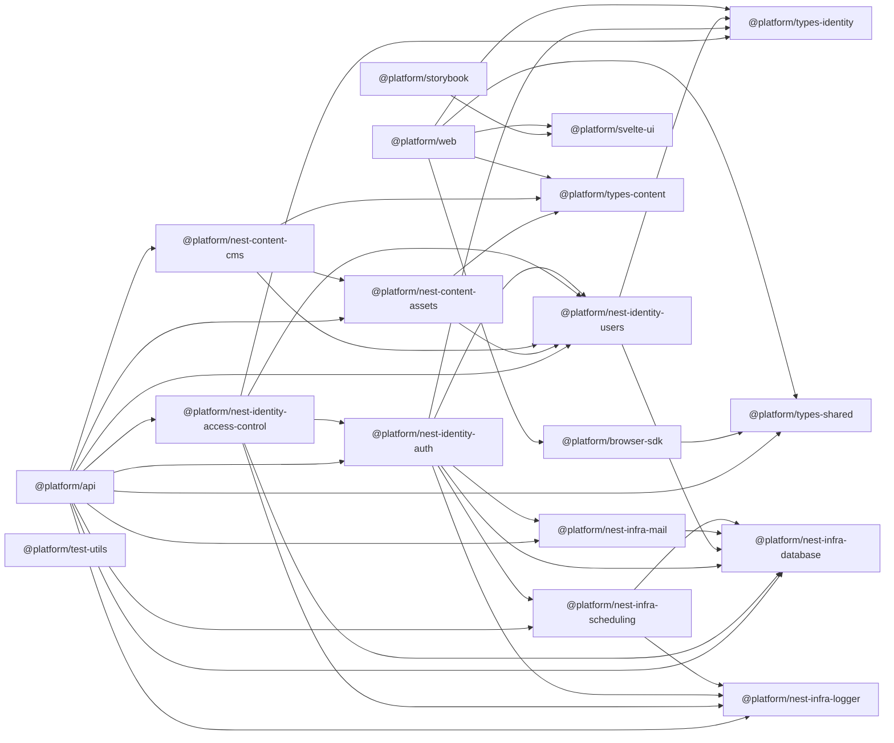

# 套件相依圖

> 此檔案由 `bun run deps:graph` 產生，請勿手動修改。箭頭表示「來源依賴目標」。

## 套件位置

- `@platform/api` — `apps/api`
- `@platform/browser-sdk` — `packages/browser/sdk`
- `@platform/nest-content-assets` — `packages/nest/content/assets`
- `@platform/nest-content-cms` — `packages/nest/content/cms`
- `@platform/nest-identity-access-control` — `packages/nest/identity/access-control`
- `@platform/nest-identity-auth` — `packages/nest/identity/auth`
- `@platform/nest-identity-users` — `packages/nest/identity/users`
- `@platform/nest-infra-database` — `packages/nest/infra/database`
- `@platform/nest-infra-logger` — `packages/nest/infra/logger`
- `@platform/nest-infra-mail` — `packages/nest/infra/mail`
- `@platform/nest-infra-scheduling` — `packages/nest/infra/scheduling`
- `@platform/storybook` — `apps/storybook`
- `@platform/svelte-ui` — `packages/svelte/ui`
- `@platform/test-utils` — `packages/testing/utils`
- `@platform/types-content` — `packages/types/content`
- `@platform/types-identity` — `packages/types/identity`
- `@platform/types-shared` — `packages/types/shared`
- `@platform/web` — `apps/web`
