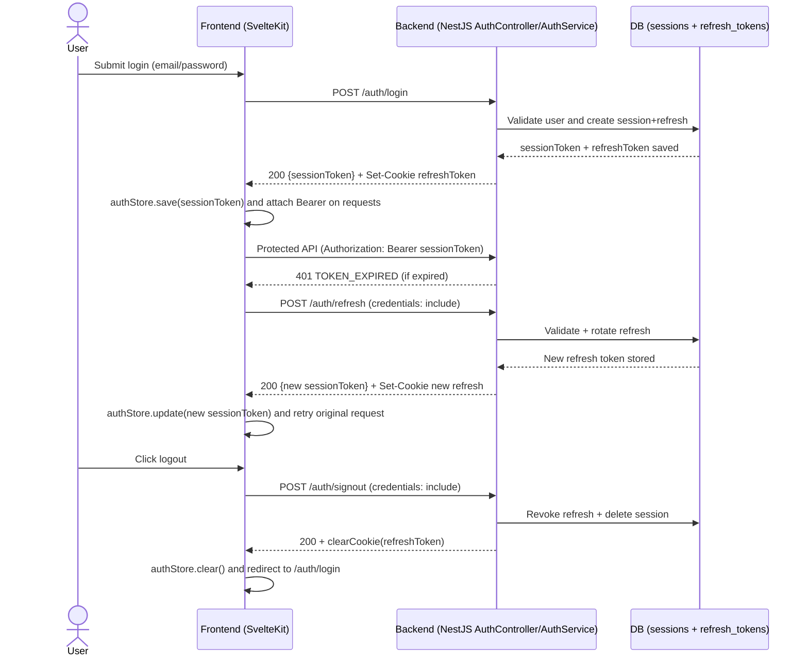

# Auth Module Progress Report

 _Last updated: 2025-11-28_

This document captures the current auth implementation status, the outstanding backlog ordered by dependency, and the daily notes that explain why items sit where they do.

---

## Product Feature Spec

### Backend capabilities (NestJS)

| Feature / capability | Status | Notes |
| --- | --- | --- |
| Email/password signup (`POST /auth/signup`) | ✅ Implemented | `AuthController.signup` delegates to `AuthService.signup`, which rejects duplicate emails, hashes passwords with bcrypt, and stores users via `UserRepository`. Sessions are created immediately after signup. |
| Email/password login (`POST /auth/login`) | ✅ Implemented | `AuthService.login` verifies the password before calling `CreateSession`, so failed logins no longer create orphaned sessions. |
| Session persistence | ✅ Implemented | Sessions + refresh tokens are created during signup/login, `/auth/inspect` now trims `Bearer` headers automatically, and `AuthService.inspectSession` maps the result into `SessionDto` so clients receive a stable DTO instead of the raw DB row. |
| Session cleanup cron | ✅ Wired | `AppModule` imports `ScheduleModule.forRoot()`, so `SessionCleanupService.cleanupExpiredSessions` runs nightly to purge expired rows. |
| Logout / session revocation (`POST /auth/signout`) | ✅ Implemented | `AuthController.signout` uses the shared extractor to revoke the DB session + refresh rows and now calls `response.clearCookie('refreshToken', …)` so browsers drop the HttpOnly cookie after logout. |
| Token refresh (`POST /auth/refresh`) | ✅ Implemented | Controller now reads the `refreshToken` cookie, `AuthService.refresh` rotates both session + refresh records, and the new HttpOnly cookie is re-issued together with the fresh session token payload. |
| Google SSO | ⚠️ Partial | Added `/auth/google/login` redirect + callback that exchanges code, creates/looks up users, mints session/refresh, sets refresh cookie, and redirects back with the access token; frontend callback handling still pending. |
| Password reset / forgot password | ❌ Missing | Backend has no endpoints, reset tokens, or email delivery yet; only the frontend scaffolding exists so far. |
| API base URL alignment | ✅ Configured | `backend/src/config/app.config.ts` and `frontend/src/lib/config/index.ts` now both default to `http://localhost:3333`, so the two sides agree as soon as `.env` populates `PORT` / `VITE_API_BASE_URL`. |
| SMTP integration testing | ⚠️ Opt-in only | Added `src/mail/jtest.spec.ts`, which sends a real SES email when `RUN_SMTP_TEST=true`. `.env` loading is commented out and credentials are shared with production keys, so the spec is disabled by default. |

### Frontend experience (SvelteKit)

| Feature / capability | Status | Notes |
| --- | --- | --- |
| Navigation layout | ✅ Basic | Global landing links live in `src/routes/+page.svelte`, and the protected dashboard mounts `AppSidebar` inside `user/+layout.svelte` for in-app navigation. |
| Login page UI | ✅ Implemented | `loginForm.service.svelte` consumes store metadata for loading/disabled states, shows inline errors, and redirects after success. |
| Signup page UI | ✅ Implemented | `signupForm.serevice.svelte` adds password length + confirm rules, inline errors, loading/disabled states, and surfaces store messages for API feedback. |
| Auth API client layer | ✅ Implemented | `httpClient` now attaches `credentials: 'include'` on all calls, bubbles backend `{ message, statusCode, error }` instead of masking them, refresh retries keep headers intact, and refreshed tokens persist back to storage for reuse. |
| Auth store (`lib/store/authStore.ts`) | ✅ Implemented | Store now hydrates safely in SSR, exposes `{ session, status, message }`, centralises `setSession/clearSession`, redirects logout to the login route, and keeps in-memory state in sync with storage after login/register/refresh. |
| Google SSO UI | ❌ Missing | The Google button is commented out in both login & signup forms, and there is no handler/OAuth flow. |
| Password reset UI | ⚠️ Partial | Added a forgot-password + OTP layout (`frontend/src/lib/module/auth/forgot-password.service.svelte`) and route shell (`frontend/src/routes/auth/forgot-password/+page.svelte`) with email capture and a verification-code state, but it is not wired to any store/API yet and lacks submit/resend handling. |
| Session handling | ⚠️ Partial | The retry scaffolding exists inside `httpClient`, but the `user/+layout` guard still references `$authStore` globals on the client only, there is no server `+layout.ts` load, and missing cookies mean refresh/signout calls continue to fail. |

### Overall status snapshot

- ✅ **Completed:** Email/password signup & login APIs now mint session+refresh tokens, `/auth/inspect` + `AuthGuard` validate them, logout/refresh endpoints rotate HttpOnly cookies, and the frontend client attaches Bearer headers using the stored tokens. Configurable port/base URL + the opt-in SMTP Jest spec remain green.
- ⚠️ **In Progress / Needs Fixes:** Backend Google OAuth callback now issues session/refresh cookies and redirects with the access token; frontend needs to consume that redirect and store tokens. Frontend still needs cookie-aware refresh/logout requests, SSR-safe store hydration/guards, and better DX safeguards for SMTP credentials/tests. Forgot-password/OTP UI now exists but remains disconnected from any API/store flow.
- ❌ **Not Started:** Password reset flow, user session UX (loading states, error handling), frontend Google SSO callback/storage.

---

## Tech Spec — Session + Refresh Lifecycle

This spec captures the agreed behaviour for how sessions/access tokens and refresh tokens interact between the NestJS backend and the SvelteKit frontend.

### Tokens & Storage
- **Session / Access Token**: short-lived credential (≈15 min) returned from `/auth/login` and `/auth/refresh`. Frontend keeps it in an in-memory store and attaches it to `Authorization: Bearer <token>` for every protected request.
- **Refresh Token**: long-lived opaque value issued via `Set-Cookie` and stored only as an HttpOnly cookie plus a DB record (`user_refresh_tokens`). Frontend code can never read it; browsers forward it automatically when `credentials: 'include'` (or `withCredentials: true`) is set.

### Login / Logout sequence (current)


### 1. 呼叫受保護 API
Frontend uses the session/access token:

```ts
await fetch('/api/protected', {
  method: 'GET',
  headers: { Authorization: `Bearer ${sessionToken}` },
});
```

Backend guard flow:
1. 讀取 Authorization header。
2. 檢查簽章 / 過期時間 / payload。
3. ✅ 有效 → 進入 controller。
4. ❌ 無效或過期 → 丟 `UnauthorizedException`（body 可附 `code: 'TOKEN_EXPIRED'`）。

### 2. 401 → 啟動 refresh
若上一個步驟得到 `401 TOKEN_EXPIRED`，前端不要立刻導去登入，而是呼叫 refresh API，並確保瀏覽器會帶上 HttpOnly cookie：

```ts
await fetch('/auth/refresh', {
  method: 'POST',
  credentials: 'include',
});
```

> 在 HttpOnly 設計下，「前端使用 refresh token」等同於「呼叫 `/auth/refresh` 並讓瀏覽器帶 cookie」，前端本身看不到 token 內容。

### 3. 後端 `/auth/refresh`
1. 從 cookie 取出 `refresh_token`。
2. 驗證：
   - Cookie 是否存在。
   - DB 是否有紀錄、是否沒過期、是否未被 revoke。
3. 結果：
   - **成功**：產生新的 session/access token；（建議）同時 rotate 一個新的 refresh token。
     - 寫入/更新 `user_refresh_tokens`，舊 token 標記 revoked。
     - ResponseInterceptor 包成：
       ```json
       {
         "statusCode": 200,
         "message": "Token refreshed",
         "data": { "sessionToken": "new-session-token" },
         "path": "/auth/refresh",
         "timestamp": "..."
       }
       ```
     - 以 `Set-Cookie` 回寫新的 refresh token（`HttpOnly; SameSite=Strict; Path=/auth/refresh; Max-Age=2592000`）。
   - **失敗（過期 / 無效 / 被撤銷）**：回傳 `401/403` 並附 `code: 'REFRESH_EXPIRED'` 之類的錯誤碼。

### 4. 前端處理 refresh 結果
- **成功**：
  1. `authStore` 更新 session/access token。
  2. 自動重送剛剛失敗的受保護 API（request wrapper/interceptor 處理）。
  3. 使用者感受不到過期發生。
- **失敗**：
  1. 清空前端 auth 狀態。
  2. 導向 `/auth/login`。

### 5. Logout / Revocation
1. 前端送 `POST /auth/logout` 並帶 `credentials: 'include'`。
2. 後端：
   - 從 cookie 取得 refresh token。
   - 在 DB 標記 revoked（或刪除）。
   - `res.clearCookie('refresh_token', { httpOnly: true, sameSite: 'strict', path: '/auth/refresh' })`。
   - 回傳統一成功訊息。
3. 前端收到後清掉 session token 並導回登入。

### 6. Sequence Snapshot
1. **Login**：驗證帳密 → 產生 session/access token、refresh token → refresh token 寫入 DB + HttpOnly Cookie → JSON 回傳 session/access token。
2. **Protected API**：攜帶 `Authorization: Bearer <session>`；若過期 → 進入 refresh。
3. **Refresh**：瀏覽器帶 Cookie，後端驗證 + rotate → 成功就回新 session token ＋ Set-Cookie 新 refresh；失敗回 401/403。
4. **Logout**：後端 revoke refresh token 並清 Cookie，下一次 refresh 會失敗並強迫重新登入。

> 下一步（TODO）：實作 request wrapper（SvelteKit load + fetch 攔截）來統一處理 `401 TOKEN_EXPIRED → refresh → 重送` 的流程。
## TODO (WBS) — ordered by dependency

- [x] [ backend ] Finalize the session/token strategy (opaque token + HttpOnly refresh cookie + rotation) and document the flow in this spec; implementation work now tracks against refresh/logout tasks.
- [x] [ backend ] Harden logout (`POST /auth/signout`) and refresh (`POST /auth/refresh`) so they strip the `Bearer` prefix, rotate refresh tokens, and clear cookies after revocation per the lifecycle spec.
- [x] [ backend ] Expose a configuration-driven API base URL/port and share it via environment variables so the frontend client can target the correct origin. (Handled via `backend/src/config/app.config.ts` + `frontend/src/lib/config/index.ts` defaults / `.env`.)
- [x] [ backend + frontend ] Normalize Authorization header usage—frontend now persists the session token to storage/`httpClient` and the guard/controllers share the `extractSessionToken` helper, so Bearer headers are parsed consistently.
- [x] [ frontend ] Align `lib/api/httpClient` + `lib/api/auth` with the NestJS contract by persisting login responses inside the auth store, including credentials on refresh/logout calls, and bubbling backend errors for the forms. (Depends on the API configuration item above.)
- [x] [ frontend ] Rework `authStore` hydration and API response plumbing so it returns `{ session, status, message }`, fixes `logout` navigation targets, and persists state between refreshes without SSR errors. (Depends on the updated client.)
- [x] [ frontend ] Convert login & signup forms to `on:submit|preventDefault`, add confirm-password rules, loading spinners, and inline error surfaces that consume the metadata exposed by the store. (Depends on the store rework.)
- [ ] [ frontend ] Update `src/routes/user/+layout.(svelte|ts)` guards to subscribe to `authStore` properly (no `$authStore` globals), enforce redirects during the server `load`, and share state with the client guard. (Depends on the store rework.)
- [ ] [ backend ] Implement Google OAuth endpoints (`/auth/google` + callback), persist federated profiles, and emit compatible session tokens. (Depends on the session/token strategy and logout/refresh work.) — login/callback now issues session+refresh cookies; pending: profile persistence refinements and frontend token consumption.
- [ ] [ frontend ] Implement Google SSO buttons/flows (render, trigger backend redirect, handle callback) that consume the new OAuth endpoints. (Depends on the backend Google OAuth item.)
- [ ] [ backend ] Add password reset initiation & confirmation endpoints, including token issuance, expiry validation, and email delivery via SMTP/SES.
- [ ] [ frontend ] Build password reset request/reset routes, forms, and success screens wired through the store once backend reset APIs ship. (Depends on the backend password reset item.)
- [ ] [ backend ] Harden session lifecycle observability (session read/delete endpoints or admin tooling) so future guards/testing can assert token states. (Depends on the logout/refresh functionality.)

---

## Working Diary

### 2025-11-10

- Wired a client-side auth guard in `frontend/src/routes/user/+layout.svelte` that subscribes to `authStore` and redirects to the login route when the session is missing.
- Remaining gaps: (1) guard still runs only on the client—need a server `+layout.ts` load that rejects unauthenticated requests before rendering; (2) `authStore` isn’t hydrated from storage/cookies yet, so the guard will misfire on hard refresh; (3) logout/refresh APIs are still stubs, so tokens are never revoked.

### 2025-11-12

- Hooked the signup and signout flows from the SvelteKit forms (`frontend/src/routes/auth/signup/+page.svelte`, `frontend/src/routes/auth/login/+page.svelte`) through `authStore` so they call the backend APIs end-to-end.
- Added a persistent sidebar to the user dashboard layout (`frontend/src/routes/user/+layout.svelte` and `frontend/src/lib/components/app-sidebar.svelte`) to surface navigation inside the protected area.

### 2025-11-15

- Locked in the end-to-end refresh-token lifecycle (access token in-memory, refresh token in HttpOnly cookie, retry-once strategy) and captured the detailed spec in the "Session + Refresh Lifecycle" section above.
- Updated the status table and backlog to reflect that the strategy is finalized while the actual `/auth/refresh` + `/auth/logout` endpoints are still pending implementation.

### 2025-11-17

- Performed a focused code review on `AuthService`, `AuthController`, `AuthGuard`, `SessionRepository`, and the SvelteKit auth store/API modules to confirm what is already wired end-to-end.
- Implemented a shared `extractSessionToken` helper so `AuthController` + `AuthGuard` can parse standard `Authorization: Bearer …` headers before reaching the repositories.
- Documented the current guard + refresh-token flow—including the broken refresh-cookie handling and remaining logout gaps—in the backend status table for follow-up fixes.
- Logged the remaining bugs (refresh cookie misuse, login not persisting tokens, undefined `resolve()` usages in the store) and updated the feature tables/TODO list accordingly.
- Added a backlog item to normalize `Authorization: Bearer …` handling on both the frontend and backend so Swagger, guards, and httpClient all agree on the contract.
- Re-checked the backend service/controller spec: `AuthService.CreateSession` still references `crypto.randomUUID()` without importing `crypto`, and `inspectSession` responds with the raw session row instead of `UserIdentityDto`, so swagger-generated clients still break.
- Audited the frontend client/store state: `authStore.login` never writes to storage, `logout` ignores `removeFromStorage`, and `httpClient.request` does not set `credentials: 'include'`, so refresh/signout flows keep failing even though Bearer headers now exist.

Addressing the dependency-ordered WBS items above will bring the implementation in line with the intended UX (email authentication + Google SSO + reset password) and make the front/back contracts consistent.

### 2025-11-19

- Added storage helpers to `frontend/src/lib/store/authStore.ts` so login/signup persist the backend session payload (including the access token) and logout clears both the store and `localStorage`, unblocking token reuse across reloads.
- Rebuilt `frontend/src/lib/api/httpClient.ts` to read the stored token, attach `Authorization: Bearer …` headers, refresh once after `401`, and push updated session tokens back into storage whenever `/auth/refresh` succeeds.
- Completed the backend refresh/logout flow: `AuthController` now reads the `refreshToken` cookie, clears it on signout, and `AuthService.refresh` rotates the session + refresh rows before issuing a new HttpOnly cookie.
- Follow-ups identified: `fetch` wrappers still miss `credentials: 'include'`, the Svelte store drops the in-memory `token` (so guards can’t inspect it), and the `user/+layout` guard needs an SSR-safe `load`.

### 2025-11-25

- Built a forgot-password/OTP layout in `frontend/src/lib/module/auth/forgot-password.service.svelte` with email capture and a loading-driven transition into a 6-digit verification form, giving the reset flow a UI shell ahead of backend/store wiring and route integration.
- Updated `frontend/src/lib/api/httpClient.ts` to send `credentials: 'include'` for cookie-bound auth calls, keep retry-after-refresh errors structured, and throw `{ message, statusCode, error }` so forms can consume backend responses; store/form wiring is still pending.

### 2025-11-27

- Completed the login/signup form UX rework: added confirm-password validation, inline field errors, and loading spinners that consume `authStore` metadata instead of local flags.
- Fixed TS typing issues by subscribing to `authStore` (typed as `AuthState`) inside the forms so `status/message` are available without `$derived` helpers.
- Updated the progress doc and WBS to reflect the completed form work; remaining frontend focus is on guards/SSR session handling.

### 2025-11-28

- Added Google OAuth `/auth/google/login` redirect + callback that exchanges the code, fetches profile, creates/looks up the user, issues session + refresh tokens via `AuthService.CreateSession`, sets the refresh cookie, and redirects back to the frontend with the access token query param.
- Next: wire the frontend callback route to read `token`, persist via `authStore`, and handle errors/redirects.
